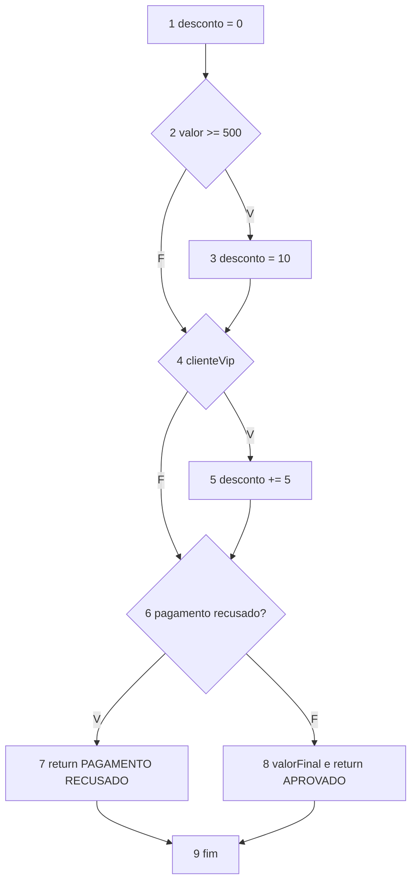
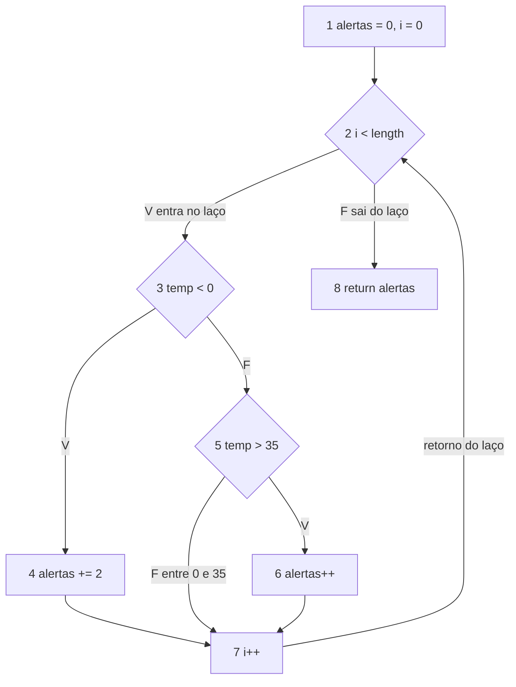

# Resolução — Grafo de Fluxo de Controle

Modelo: cada decisão tem saída verdadeira e falsa; o return e o fim do método convergem para um nó fim; o laço tem aresta de retorno. V(G) = E − N + 2 deve coincidir com decisões + 1.

---

## Exercício 1 — Classificação de pedido

### 1. Blocos básicos

| Nó | Tipo | Conteúdo |
| --- | --- | --- |
| 1 | sequencial | desconto = 0 |
| 2 | decisão | valor >= 500 |
| 3 | sequencial | desconto = 10 |
| 4 | decisão | clienteVip |
| 5 | sequencial | desconto += 5 |
| 6 | decisão | pagamento não aprovado |
| 7 | return | PAGAMENTO RECUSADO |
| 8 | sequencial + return | valorFinal e PEDIDO APROVADO |
| 9 | fim | encerramento do método |

### 2. Decisões

1. valor >= 500
2. clienteVip
3. pagamento não aprovado

### 3 e 4. CFG (o return antecipado vai ao fim sem passar pelo nó 8)

### 5 e 6. Contagem e McCabe

- N = 9
- E = 11 (1→2, 2→3, 2→4, 3→4, 4→5, 4→6, 5→6, 6→7, 6→8, 7→9, 8→9)
- V(G) = 11 − 9 + 2 = 4

### 7. Conferência

V(G) = 3 decisões + 1 = 4

### 8, 9 e 10. Base de caminhos independentes

Cada caminho novo inclui pelo menos uma aresta que os anteriores não usaram.

| Caminho | Nós | valor | clienteVip | pagamentoAprovado | desconto | Resultado esperado |
| --- | --- | --- | --- | --- | --- | --- |
| C1 | 1-2-4-6-8-9 | 100 | false | true | 0 | PEDIDO APROVADO: 100.0 |
| C2 | 1-2-3-4-6-8-9 | 500 | false | true | 10 | PEDIDO APROVADO: 450.0 |
| C3 | 1-2-4-5-6-8-9 | 100 | true | true | 5 | PEDIDO APROVADO: 95.0 |
| C4 | 1-2-4-6-7-9 | 100 | false | false | 0 | PAGAMENTO RECUSADO |

C1 cobre o tronco. C2 acrescenta 2→3 e 3→4. C3 acrescenta 4→5 e 5→6. C4 acrescenta 6→7 e 7→9.

Combinação extra (não precisa entrar na base): valor = 500, clienteVip = true, pagamentoAprovado = true → desconto 15 → PEDIDO APROVADO: 425.0.

### Discussão

Quantas combinações entre as três condições são possíveis?

8. Cada condição é binária: (valor >= 500) × clienteVip × pagamentoAprovado.

O número de combinações é igual à complexidade ciclomática?

Não. V(G) = 4 é o tamanho de uma base de caminhos independentes, não o número de combinações. As três decisões são em sequência e independentes: 2³ = 8 execuções distintas, mas quatro caminhos já cobrem todas as arestas.

Como o return da terceira condição altera o grafo?

A saída verdadeira do nó 6 vai ao nó 7 e daí ao fim. Esse fluxo não passa pelo cálculo de valorFinal. Sem o return antecipado, os dois ramos de pagamento cairiam no mesmo bloco final.

É possível executar o cálculo de valorFinal quando o pagamento não foi aprovado?

Não. O return do nó 7 encerra o método.

---

## Exercício 2 — Análise de leituras de temperatura

### 1. Blocos básicos

| Nó | Tipo | Conteúdo |
| --- | --- | --- |
| 1 | sequencial | alertas = 0, i = 0 |
| 2 | decisão (laço) | i < tamanho do vetor |
| 3 | decisão | temperatura < 0 |
| 4 | sequencial | alertas += 2 |
| 5 | decisão | temperatura > 35 |
| 6 | sequencial | alertas++ |
| 7 | sequencial | i++ |
| 8 | return / fim | return alertas |

### 2. Decisões

1. while (i < tamanho) — entra no laço ou sai
2. if (temperatura < 0) — alerta frio (+2)
3. else if (temperatura > 35) — só avaliado se a anterior for falsa; alerta calor (+1)

Três classificações da temperatura:

- menor que 0 → nó 4
- maior que 35 → nó 6
- entre 0 e 35, inclusive → do nó 5 (falso) direto ao nó 7, sem somar alerta

### 3 e 4. CFG

### 5 e 6. Contagem e McCabe

- N = 8
- E = 10 (1→2, 2→3, 2→8, 3→4, 3→5, 4→7, 5→6, 5→7, 6→7, 7→2)
- V(G) = 10 − 8 + 2 = 4
- V(G) = 3 decisões + 1 = 4

### 7, 8 e 9. Base de caminhos e vetores

| Caminho | Nós | Vetor | O que exercita | Retorno |
| --- | --- | --- | --- | --- |
| C1 | 1-2-8 | vazio | sai do laço sem iterar; não acessa o vetor | 0 |
| C2 | 1-2-3-4-7-2-8 | -5 | ramo negativo | 2 |
| C3 | 1-2-3-5-6-7-2-8 | 36 | ramo acima de 35 | 1 |
| C4 | 1-2-3-5-7-2-8 | 0 ou 35 ou 20 | faixa 0 a 35 inclusive | 0 |

C1 cobre a saída imediata. C2 acrescenta a entrada no laço, o ramo menor que 0 e o retorno 7→2. C3 acrescenta 3→5, 5→6 e 6→7. C4 acrescenta 5→7.

### 10. Por que o retorno do laço precisa aparecer no CFG

A aresta 7 → 2 é o que fecha o ciclo. Sem ela, o grafo fingiria que o corpo roda uma vez só. Essa aresta é uma das 10 e entra no V(G). Com várias temperaturas, a execução repete nós e arestas do corpo; não é um caminho linear novo a cada elemento.

### Discussão

Um vetor com várias temperaturas percorre um único caminho ou pode repetir partes do grafo?

Uma execução só, mas o corpo do laço pode ser visitado várias vezes. O vetor -5, 36, 20 passa pelos três ramos internos na mesma chamada, voltando sempre pelo 7→2.

Qual entrada permite sair sem acessar uma posição do vetor?

Vetor vazio: a condição do while é falsa na primeira avaliação (0 < 0).

Os testes de 0 e 35 ajudam a avaliar quais fronteiras?

0 é a fronteira de temperatura < 0 (não entra no +2). 35 é a fronteira de temperatura > 35 (não entra no +1). Os dois caem no ramo normal.

Por que o else if é uma nova decisão?

Ele só roda quando temperatura < 0 é falso. Tem saída verdadeira (> 35) e falsa (0 a 35). Contar só um if apagaria um ramo e o V(G) cairia para 3.

---

## Conferência dos critérios

- Sequências sem desvio estão em um bloco (nós 1, 3, 5, 7, 8 do ex. 1; nós 1, 4, 6, 7 do ex. 2).
- Cada decisão tem V e F.
- O return antecipado do pedido vai ao fim e não calcula valorFinal.
- O while tem aresta de retorno 7→2.
- Todos os nós são alcançáveis.
- Nos dois exercícios: E − N + 2 = decisões + 1 = 4.
- Cada caminho da base acrescenta aresta nova.
- Há dados para executar cada caminho.
