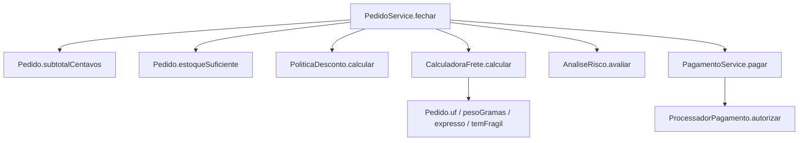
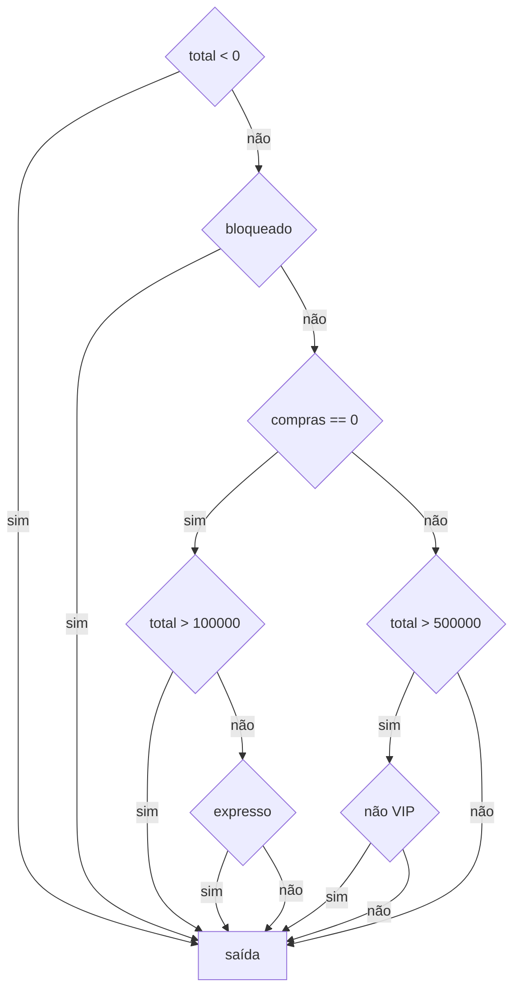
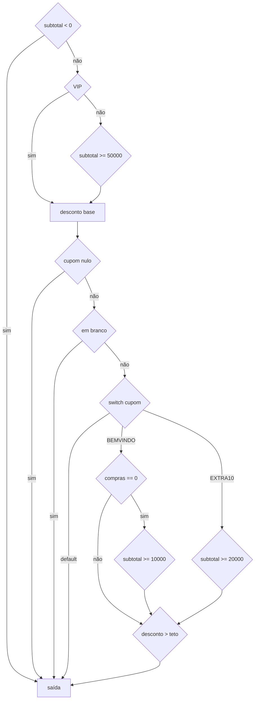
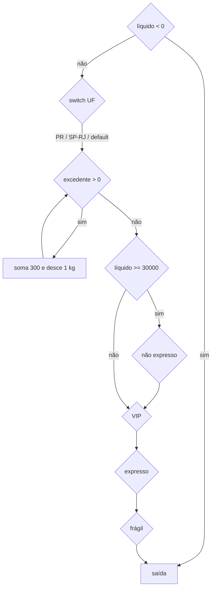
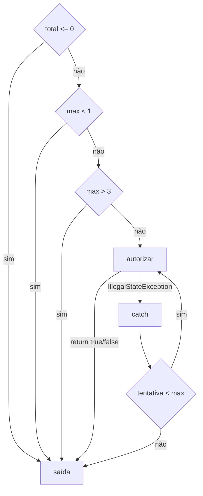
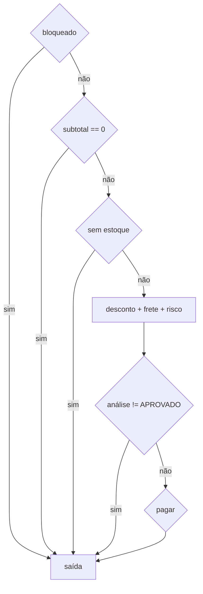

# Relatório do grupo

Integrantes:
Filipe Ruiz Boligon
Thiago Fernando Zulli
Gabriel Arantes
Filipe Senra Gonçalves

## Modelo adotado

- Cada operando de `&&` e `||` é um nó de decisão separado (curto-circuito).
- `throw` e `catch` são arestas do CFG até a saída unificada. O JaCoCo **não** conta essas arestas como branch.
- `requireNonNull` também é exceção, não branch.
- Switch de UF: 3 saídas de valor (PR, SP/RJ no mesmo bloco, default).
- Switch de cupom: 3 saídas (BEMVINDO, EXTRA10, default).
- Todo `return`/`throw` converge para um nó de saída. Fórmula: `V(G) = E − N + 2`.

## Grafo de chamadas de `fechar`

## CFGs

### `AnaliseRisco.avaliar`

### `PoliticaDesconto.calcular`

### `CalculadoraFrete.calcular`

### `PagamentoService.pagar`

O `catch` entra no CFG e no McCabe abaixo. O JaCoCo não marca essa aresta como branch (8 branches = só as 4 decisões booleanas).

### `PedidoService.fechar`

`requireNonNull` de pedido/cliente lança NPE antes dessas decisões e não entra no contador de branches.

## Grafos e complexidade

| Método | Nós | Arestas | V(G) | Caminhos independentes | Restrições de viabilidade |
| --- | --- | --- | --- | --- | --- |
| `AnaliseRisco.avaliar` | 8 | 14 | 8 | 8 | Todos viáveis na unidade |
| `PoliticaDesconto.calcular` | 12 | 22 | 12 | 12 | Cupom nulo/branco sai antes do switch; default só com cupom desconhecido |
| `CalculadoraFrete.calcular` | 10 | 18 | 10 | 10 | Zerar base **e** ser expresso é inviável: o zero exige `!expresso` |
| `PagamentoService.pagar` | 7 | 11 | 6 | 6 | Outras exceções saem sem retry. JaCoCo: 4 decisões (V=5) porque o catch não é branch |
| `PedidoService.fechar` | 6 | 10 | 6 | 6 | `RECUSADO` do risco é inviável aqui: bloqueado já voltou `BLOQUEADO` |
| `Pedido.subtotalCentavos` | 4 | 5 | 3 | 3 | `continue` no item com quantidade 0 |
| `Pedido.temFragil` | 5 | 7 | 4 | 4 | `&&` curto-circuita se quantidade = 0 |
| `Pedido.estoqueSuficiente` | 5 | 6 | 3 | 3 | `break` na primeira falta de estoque |

Base de caminhos de `avaliar` (dados que realizam cada um):

1. total = −1 → `IllegalArgumentException`
2. bloqueado → `RECUSADO`
3. novo, total 150000, não expresso → `REVISAO`
4. novo, total 50000, expresso → `REVISAO`
5. novo, total 100000, não expresso → `APROVADO`
6. antigo comum, total 600000 → `REVISAO`
7. antigo VIP, total 600000 → `APROVADO`
8. antigo comum, total 500000 → `APROVADO`

## Matriz de testes

| ID / método JUnit | Unidade | Entrada e estado do stub | Resultado esperado | Caminho / aresta | Critério atendido |
| --- | --- | --- | --- | --- | --- |
| `testAvaliar` c1 | risco | novo, 150000, normal | REVISAO | P3: total > 1000 | ramo `\|\|` esquerdo |
| `testAvaliar` c2 | risco | novo, 50000, expresso | REVISAO | P4: expresso | ramo `\|\|` direito |
| `testAvaliar` c3 | risco | comum 5 compras, 600000 | REVISAO | P6 | `&&` os dois verdadeiros |
| `testAvaliar` c4 | risco | bloqueado | RECUSADO | P2 | retorno antecipado |
| `testAvaliar` c5 | risco | VIP 5 compras, 600000 | APROVADO | P7 | `&&` com `!vip` falso |
| `testAvaliar` c6 | risco | novo, 100000, normal | APROVADO | P5 | os dois lados do `\|\|` falsos |
| `testAvaliar` c7 | risco | comum 1 compra, 500000 | APROVADO | P8 | `&&` curto: total não passa |
| `testAvaliar` c8 | risco | novo, 150000, expresso | REVISAO | P3 com os dois lados do `\|\|` | combinação extra (caminho ≠ ramo) |
| `testTotalNegativo` | risco | total −1 | IAE "Total negativo" | P1 | exceção (não é branch) |
| `testCalcular` | desconto | VIP 10000 sem cupom | 1000 | base 10% | ramo VIP |
| `testCalcular` | desconto | comum 50000 / 49999 | 2500 / 0 | 5% e zero | limiar R$ 500 |
| `testCalcular` | desconto | cupom nulo ou `"   "` | desconto base | saída antecipada | curto-circuito `\|\|` |
| `testCalcular` | desconto | novo BEMVINDO 10000 / 9999 | 2000 / 0 | case BEMVINDO | `&&` e limiar R$ 100 |
| `testCalcular` | desconto | comum BEMVINDO | 0 | compras ≠ 0 | curto-circuito do `&&` |
| `testCalcular` | desconto | EXTRA10 20000 / 19999 | 2000 / 0 | case EXTRA10 | limiar R$ 200 |
| `testCalcular` | desconto | VIP novo BEMVINDO 10000 | 2000 (teto) | 10% + 20 > 20% | ramo teto verdadeiro |
| `testCalcular` | desconto | VIP EXTRA10 20000 | 4000 | 10% + 10% = teto | ramo teto falso |
| `testExcecoes` | desconto | subtotal −1 / cupom FOO | IAE | throw e default | exceção + case default |
| `testCalcular` | frete | PR / SP / RJ / MG | 1200 / 2000 / 2000 / 3000 | switch UF | cases e default |
| `testCalcular` | frete | 2000 g / 2001 g / 3001 g | 0 / 1 / 2 voltas no while | laço | 0, 1 e várias iterações; kg exato e fração |
| `testCalcular` | frete | líquido 30000 normal | 0 | gratuidade | `&&` os dois verdadeiros |
| `testCalcular` | frete | 29999; 30000 expresso | 1200; 2700 | sem zero | limiar e `!expresso` falso |
| `testCalcular` | frete | VIP; frágil; VIP+frágil grátis | 600; 1700; 500 | ifs finais | decisões independentes |
| `testLiquidoNegativo` | frete | líquido −1 | IAE | throw | exceção |
| `testPagar` | pagamento | stub true / false | true / false | 1 chamada, sem retry | retorno do processador |
| `testPagar` | pagamento | 2 ISE + true | true, 3 chamadas | do/while + catch | retry até sucesso |
| `testPagar` | pagamento | 3 ISE | false, 3 chamadas | esgotamento | volta do laço e return false |
| `testExcecoes` | pagamento | total 0; max 0 e 4 | IAE | validações | ramos `\|\|` |
| `testExcecoes` | pagamento | RuntimeException | propaga | fora do catch | exceção não representada como branch |
| `testCliente` / `testHistoricoInvalido` | cliente | válido / compras −1 | getters / IAE | compact | construtor |
| `testItem` / `testExcecoes` | item | limites e inválidos | total, disponível, IAE | compact | SKU, preço, qtd, estoque, peso |
| `testPedido` | pedido | ativo + inativo + frágil | subtotal 21000, peso 400, frágil | for + continue | linha inativa não soma valor |
| `testCopiaDaListaEInativos` | pedido | lista mutada depois | tamanho 1 | copyOf | cópia defensiva |
| `testEstoqueInsuficiente` | pedido | falta no início e no fim; vazio | false / true | break e 0 iterações | for + break |
| `testExcecoes` | pedido | lista nula/101; UF; item nulo | IAE / NPE | construtor | inválidos |
| exemplo `PedidoServiceTest` | serviço | comum PR, stub true | PAGO 11200, 1 cobrança | caminho feliz | colaboração |
| `testClienteBloqueado` | serviço | bloqueado + cupom FOO | BLOQUEADO, 0 cobranças | retorno cedo | cupom nem é avaliado |
| `testSemEstoque` | serviço | qtd > estoque + cupom FOO | SEM_ESTOQUE, 0 cobranças | retorno cedo | cupom nem é avaliado |
| `testPedidoSemItensAtivos` | serviço | quantidade 0 | IAE | subtotal 0 | exceção |
| `testRevisaoNaoCobra` | serviço | novo + expresso, stub true | REVISAO 12700, 0 cobranças | risco pendente | processador não chamado |
| `testPagamentoRecusado` | serviço | stub false | PAGAMENTO_RECUSADO 11200 | pagar falso | valores calculados |
| `testVipComCupom` | serviço | VIP EXTRA10, stub true | PAGO 16600 | desconto 20% + frete metade | colaboração |
| `testReferenciasNulas` | serviço | pedido ou cliente nulo | NPE | requireNonNull | exceção, sem branch |

## Evolução da cobertura

Relatório gerado por `mvn clean test` em `target/site/jacoco/index.html`.

| Etapa | Testes executados | Linhas | Branches | Métodos | Classes | Lacunas e justificativas |
| --- | --- | --- | --- | --- | --- | --- |
| Inicial | 0 | Não medido | Não medido | Não medido | Não medido | Sem testes |
| Só o exemplo do `PedidoServiceTest` | 1 | parcial | vários ramos abertos | parte do `fechar` | as 9 classes já são tocadas | Um caminho feliz não cobre bloqueio, estoque, revisão, recusa, laços nem cupons |
| Suíte das unidades (risco, desconto, frete, pagamento, domínio) | 16 | sobe para perto de 100% | ramos de `&&`/`\|\|`, switch e while | métodos auxiliares | 9/9 | Faltavam retornos antecipados do serviço e o teto do desconto |
| Suíte completa + correção do oráculo VIP+BEMVINDO | 24 | **108/108 (100%)** | **116/116 (100%)** | **21/21 (100%)** | **9/9 (100%)** | 100% de ramos não é 100% de caminhos. Catch e `throw` continuam fora do contador |

Por classe (JaCoCo):

| Classe | Linhas | Branches | Métodos |
| --- | --- | --- | --- |
| Pedido | 25 | 24 | 5 |
| PedidoService | 22 | 10 | 3 |
| PoliticaDesconto | 14 | 21 | 2 |
| ItemPedido | 9 | 20 | 3 |
| CalculadoraFrete | 15 | 17 | 2 |
| PagamentoService | 11 | 8 | 2 |
| AnaliseRisco | 8 | 14 | 2 |
| Cliente | 3 | 2 | 1 |
| ResultadoPedido | 1 | n/a | 1 |

## Análise crítica

**Cobertura de ramos não demonstra cobertura de caminhos.** Em `CalculadoraFrete`, gratuidade, VIP, expresso e frágil são decisões em sequência. Poucos testes cobrem o verdadeiro e o falso de cada `if` (JaCoCo 100% de branches). Os caminhos combinam essas decisões: frete pago + VIP + frágil é outro caminho que frete grátis + VIP + frágil. O mesmo vale para `total > 100000 || expresso` em `avaliar`: cobrir cada lado do `||` (c1 e c2) não exige o caso em que os dois são verdadeiros (c8). Esse caso devolve o mesmo `REVISAO`, mas percorre outra combinação. Laços no peso também multiplicam caminhos (0, 1, 2+ voltas) além dos dois ramos da condição.

**Exceção que o JaCoCo não conta como branch.** `catch (IllegalStateException)` em `pagar` é aresta do CFG (retry) e não aparece nos 8 branches da classe. `testPagar` força ISE duas vezes e depois autoriza; `testExcecoes` lança `RuntimeException` para mostrar que só ISE tenta de novo. O `throw` de total negativo em `avaliar` (`testTotalNegativo`) também não entra no contador de branches: os 14 ramos de `AnaliseRisco` são só as decisões booleanas.

**Curto-circuito.** Com cupom `null`, `isBlank()` não roda. Com cliente que já comprou, `BEMVINDO` não avalia `subtotal >= 10000`. Com total ≤ 500000 no cliente antigo, `!vip` não é avaliado.

**Inviável no serviço, viável na unidade.** `avaliar` devolve `RECUSADO` só se o cliente está bloqueado. `fechar` devolve `BLOQUEADO` antes e nunca chama o risco nesse caso. Frete zerado com expresso também é inviável: a base só zera quando a entrega é normal.

**Exceções e iterações.** Exceções foram checadas com `try/catch` e `assertEquals` na mensagem (total negativo, cupom FOO, líquido negativo, total/tentativas inválidos, SKU/UF/lista, NPE). While do peso: 0, 1 e 2 voltas (2000 g, 2001 g, 3001 g). `do/while` do pagamento: 1 chamada, 3 tentativas com sucesso na última, 3 ISE até esgotar.

**Alteração proposital.** Em `AnaliseRisco.avaliar`, `RECUSADO` foi trocado por `NEGADO`. `AnaliseRiscoTest.testAvaliar` (cliente4) falhou: esperava `RECUSADO`. A alteração foi desfeita antes da entrega. O oráculo de `PoliticaDescontoTest` também errou na primeira versão (VIP com histórico + `BEMVINDO` não soma R$ 20; o teto só aparece com VIP novo). Corrigido para `vipNovo`.
